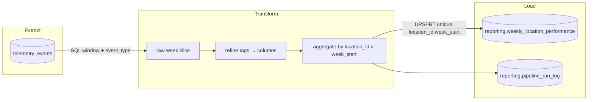

# PIPELINE_DESIGN — Brasaland Digital  
## Reporte Semanal de Costo y Merma por Local

**Tipo de hito:** diseño (sin orquestación Prefectora aún)  
**Rama:** `pipeline-design`  
**CONTEXT de negocio:** [`docs/pipelines/CONTEXT-brasaland.es.pipeline.md`](../../docs/pipelines/CONTEXT-brasaland.es.pipeline.md)  
**CONTEXT de telemetría (métricas obligatorias):** [`docs/telemetry/CONTEXT-brasaland.es.telemetria.md`](../../docs/telemetry/CONTEXT-brasaland.es.telemetria.md)  
**Fecha:** 2026-08-21  

> Este documento es la especificación del **pipeline de desempeño de negocio**.  
> No sustituye el reporte técnico de ingeniería (`services/telemetry/analysis.py`, `GET /telemetry/report`).

---

## Fase 1 — Estado actual y gap de negocio

### 1.1 Estado actual de la telemetría

| Pieza | Dónde vive | Qué responde hoy |
|-------|------------|------------------|
| Captura FE | `uis/backoffice` → `track()` / `TelemetryService` | Emite eventos de inventario + técnicos al sink |
| Almacenamiento | tabla `telemetry_events` (Supabase/SQLite) | Hechos append-only: `event_type`, `timestamp`, `tags` (JSONB), `event_id`, etc. |
| Reporte técnico | `services/telemetry/analysis.py` + `GET /telemetry/report` | Volumen diario, tasa de error por tipo, fallo de login, latencia por ruta |
| Dashboard ops | backoffice `/telemetry` | Vista de ingeniería (salud del sistema), no KPIs de margen |

**Eventos de inventario ya instrumentados (obligatorios CONTEXT telemetría):**

- `inbound_order_created`
- `outbound_order_created`
- `stock_waste_registered`
- `stock_threshold_triggered`
- `direct_stock_edit_rejected`
- `ingredient_price_variance_detected`

**Vocabulario del monorepo (no reinventar):**

| CONTEXT negocio | Código actual |
|-----------------|---------------|
| `Product` | `Ingredient` / `product_id` en tags |
| `InboundOrder` | `IngredientEntry` |
| `OutboundOrder` | `IngredientExit` |
| `location` | `location_id` entero **1–14** + `country` `CO`/`US` |
| Moneda | `COP` (CO) / `USD` (US) — sin conversión FX en v1 |

### 1.2 Qué ya responde el reporte técnico (ingeniería)

- ¿Hay tráfico de telemetría? → `events_per_day`
- ¿Qué errores técnicos dominan? → `error_rate_by_type`
- ¿Fallan los logins? → `auth_failure_rate`
- ¿Qué rutas van lentas? → `latency_by_route`

Esas preguntas son para el equipo de ingeniería. **No** responden a Mariana ni a Felipe.

### 1.3 Gap de negocio (por qué hace falta este pipeline)

Mariana (CEO) y Felipe (Ops) necesitan cada **lunes** un consolidado por local/país de **costo de compra, costo de merma, ratio de merma, quiebres de stock y alertas de precio**.

Ese entregable **no** existe hoy:

- `GET /telemetry/report` no agrega costos ni granula por `location_id` / semana ISO.
- `telemetry_events` es la fuente cruda; no es un almacén de KPIs de negocio.
- Sin una tabla en esquema `reporting` + un módulo `services/reporting/`, el liderazgo seguiría pidiendo exports manuales.

**Gap explícito:** pasar de eventos técnicos/operativos crudos a los **cinco KPIs** del CONTEXT de pipeline (sección 2), con grano `location_id` × `week_start`.

### 1.4 Extensión de captura requerida (aditiva, no evento nuevo)

Para calcular costos, `inbound_order_created` y `stock_waste_registered` deben llevar costo en `properties`:

| Evento | Campo aditivo | Uso |
|--------|---------------|-----|
| `inbound_order_created` | `unit_cost` (ya en allowlist; reforzar emisión) y/o `total_cost = quantity * unit_cost` | KPI costo de compra |
| `stock_waste_registered` | `unit_cost` y/o `total_cost` (añadir al schema/allowlist) | KPI costo de merma |

No se inventan `event_type` nuevos. No se escribe nunca de vuelta en `telemetry_events` desde el pipeline.

---

## Fase 2 — Diseño del pipeline

### 2.1 Propósito (una frase)

Construir el **Reporte Semanal de Costo y Merma por Local** para Mariana (CEO) y Felipe (Ops), con cadencia **semanal (lunes UTC)**, calculando los KPIs `total_purchase_cost`, `total_waste_cost`, `waste_ratio`, `stockout_events_count` y `price_alert_events_count` a partir de las métricas obligatorias `inbound_order_created`, `stock_waste_registered`, `stock_threshold_triggered` e `ingredient_price_variance_detected`.

### 2.2 Extracción

| Atributo | Decisión |
|----------|----------|
| **Fuente** | `telemetry_events` (**solo lectura**) |
| **Filtro SQL** | `timestamp >= :week_start AND timestamp < :week_end` (ventana half-open UTC) y `event_type IN (...)` |
| **Eventos v1** | `inbound_order_created`, `stock_waste_registered`, `stock_threshold_triggered`, `ingredient_price_variance_detected` (`outbound_order_created` opcional solo para anomalías, no entra a KPIs) |
| **Formato entrante** | Filas con `event_id`, `event_type`, `timestamp`, `tags` JSONB (`location_id`, `country`, `quantity`, `unit_cost`/`total_cost`, `currency`, …) |
| **Frecuencia** | Scheduled semanal (domingo 23:30 UTC o lunes 05:00 UTC) + trigger manual vía API |
| **Otras tablas** | Ninguna obligatoria en v1; el dominio inventario SQL (`ingredient_*`) **no** es fuente del KPI (evita doble conteo). |

### 2.3 Flujo ETL (tres etapas mínimas)

**Detalle por etapa**

1. **Extract** — consulta acotada a la semana ISO objetivo; nunca `SELECT *` sin ventana.
2. **Transform** (`data/process/` en implementación futura) — parsear `tags`, tipar timestamps UTC, calcular `line_cost = coalesce(total_cost, quantity * unit_cost)`, agrupar:
   - compra ← suma costos de `inbound_order_created`
   - merma ← suma costos de `stock_waste_registered`
   - `waste_ratio = waste / purchase` (0 si purchase = 0)
   - conteos de `stock_threshold_triggered` y `ingredient_price_variance_detected`
   - `currency` por `country` del local (`CO`→`COP`, `US`→`USD`); **nunca mezclar monedas en una fila**.
3. **Load** — upsert en `reporting.weekly_location_performance`; escribir metadata de corrida en `reporting.pipeline_run_log`.

### 2.4 Estrategia ante actualizaciones / re-corridas

- Origen `telemetry_events` es **append-only** (no UPDATE de hechos).
- Destino de negocio **sí** se actualiza: constraint `UNIQUE (location_id, week_start)` + **UPSERT** (`ON CONFLICT … DO UPDATE`) recalculando todos los campos KPI y `computed_at = now()`.
- Así una re-ejecución de la misma semana (cron + trigger manual, o eventos tardíos) **reemplaza** la fila agregada sin duplicar locales.

### 2.5 Tabla de destino (schema `reporting`)

Nombre fijado por CONTEXT (no usar nombres genéricos tipo `business_metrics`):

Ver SQL canónico: [`services/api/sql/reporting_weekly_location_performance.sql`](../../services/api/sql/reporting_weekly_location_performance.sql)

Campos KPI ↔ CONTEXT:

| Columna | KPI |
|---------|-----|
| `total_purchase_cost` | Costo de compra por local |
| `total_waste_cost` | Costo de merma por local |
| `waste_ratio` | Ratio de merma |
| `stockout_events_count` | Frecuencia de quiebre de stock |
| `price_alert_events_count` | Frecuencia de alertas de precio |

`location_id` se persiste como **texto** del id numérico del monorepo (`"1"`…`"14"`), alineado con `tags.location_id` actual.

### 2.6 Separación de módulos y endpoints (nombres)

| Qué | Dónde | Nota |
|-----|-------|------|
| Orquestación | `data/pipelines/` (Prefect flow futuro) | services solo importan desde aquí |
| Transforms reutilizables | `data/process/` | sin HTTP |
| HTTP negocio | **nuevo** `services/reporting/` | separado de `services/telemetry/` |
| Prohibido | escribir en `telemetry_events`; modificar `analysis.py` / `GET /telemetry/report` | fuera de alcance |

Endpoints previstos (detalle en Fase 5):

- `GET /reporting/weekly-location-performance`
- `GET /reporting/pipeline-runs/latest`
- `POST /reporting/pipeline-runs`
