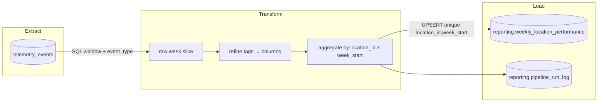

# PIPELINE_DESIGN — Brasaland Digital  
## Reporte Semanal de Costo y Merma por Local

**Tipo de hito:** diseño (sin orquestación Prefectora aún)  
**Rama:** `pipeline-design`  
**CONTEXT de negocio:** [`docs/pipelines/CONTEXT-brasaland.es.pipeline.md`](../../docs/pipelines/CONTEXT-brasaland.es.pipeline.md)  
**CONTEXT de telemetría (métricas obligatorias):** [`docs/telemetry/CONTEXT-brasaland.es.telemetria.md`](../../docs/telemetry/CONTEXT-brasaland.es.telemetria.md)  
**Fecha:** 2026-08-21  

> Este documento es la especificación del **pipeline de desempeño de negocio**.  
> No sustituye el reporte técnico de ingeniería (`services/telemetry/analysis.py`, `GET /telemetry/report`).

---

## Fase 1 — Estado actual y gap de negocio

### 1.1 Estado actual de la telemetría

| Pieza | Dónde vive | Qué responde hoy |
|-------|------------|------------------|
| Captura FE | `uis/backoffice` → `track()` / `TelemetryService` | Emite eventos de inventario + técnicos al sink |
| Almacenamiento | tabla `telemetry_events` (Supabase/SQLite) | Hechos append-only: `event_type`, `timestamp`, `tags` (JSONB), `event_id`, etc. |
| Reporte técnico | `services/telemetry/analysis.py` + `GET /telemetry/report` | Volumen diario, tasa de error por tipo, fallo de login, latencia por ruta |
| Dashboard ops | backoffice `/telemetry` | Vista de ingeniería (salud del sistema), no KPIs de margen |

**Eventos de inventario ya instrumentados (obligatorios CONTEXT telemetría):**

- `inbound_order_created`
- `outbound_order_created`
- `stock_waste_registered`
- `stock_threshold_triggered`
- `direct_stock_edit_rejected`
- `ingredient_price_variance_detected`

**Vocabulario del monorepo (no reinventar):**

| CONTEXT negocio | Código actual |
|-----------------|---------------|
| `Product` | `Ingredient` / `product_id` en tags |
| `InboundOrder` | `IngredientEntry` |
| `OutboundOrder` | `IngredientExit` |
| `location` | `location_id` entero **1–14** + `country` `CO`/`US` |
| Moneda | `COP` (CO) / `USD` (US) — sin conversión FX en v1 |

### 1.2 Qué ya responde el reporte técnico (ingeniería)

- ¿Hay tráfico de telemetría? → `events_per_day`
- ¿Qué errores técnicos dominan? → `error_rate_by_type`
- ¿Fallan los logins? → `auth_failure_rate`
- ¿Qué rutas van lentas? → `latency_by_route`

Esas preguntas son para el equipo de ingeniería. **No** responden a Mariana ni a Felipe.

### 1.3 Gap de negocio (por qué hace falta este pipeline)

Mariana (CEO) y Felipe (Ops) necesitan cada **lunes** un consolidado por local/país de **costo de compra, costo de merma, ratio de merma, quiebres de stock y alertas de precio**.

Ese entregable **no** existe hoy:

- `GET /telemetry/report` no agrega costos ni granula por `location_id` / semana ISO.
- `telemetry_events` es la fuente cruda; no es un almacén de KPIs de negocio.
- Sin una tabla en esquema `reporting` + un módulo `services/reporting/`, el liderazgo seguiría pidiendo exports manuales.

**Gap explícito:** pasar de eventos técnicos/operativos crudos a los **cinco KPIs** del CONTEXT de pipeline (sección 2), con grano `location_id` × `week_start`.

### 1.4 Extensión de captura requerida (aditiva, no evento nuevo)

Para calcular costos, `inbound_order_created` y `stock_waste_registered` deben llevar costo en `properties`:

| Evento | Campo aditivo | Uso |
|--------|---------------|-----|
| `inbound_order_created` | `unit_cost` (ya en allowlist; reforzar emisión) y/o `total_cost = quantity * unit_cost` | KPI costo de compra |
| `stock_waste_registered` | `unit_cost` y/o `total_cost` (añadir al schema/allowlist) | KPI costo de merma |

No se inventan `event_type` nuevos. No se escribe nunca de vuelta en `telemetry_events` desde el pipeline.

---

## Fase 2 — Diseño del pipeline

### 2.1 Propósito (una frase)

Construir el **Reporte Semanal de Costo y Merma por Local** para Mariana (CEO) y Felipe (Ops), con cadencia **semanal (lunes UTC)**, calculando los KPIs `total_purchase_cost`, `total_waste_cost`, `waste_ratio`, `stockout_events_count` y `price_alert_events_count` a partir de las métricas obligatorias `inbound_order_created`, `stock_waste_registered`, `stock_threshold_triggered` e `ingredient_price_variance_detected`.

### 2.2 Extracción

| Atributo | Decisión |
|----------|----------|
| **Fuente** | `telemetry_events` (**solo lectura**) |
| **Filtro SQL** | `timestamp >= :week_start AND timestamp < :week_end` (ventana half-open UTC) y `event_type IN (...)` |
| **Eventos v1** | `inbound_order_created`, `stock_waste_registered`, `stock_threshold_triggered`, `ingredient_price_variance_detected` (`outbound_order_created` opcional solo para anomalías, no entra a KPIs) |
| **Formato entrante** | Filas con `event_id`, `event_type`, `timestamp`, `tags` JSONB (`location_id`, `country`, `quantity`, `unit_cost`/`total_cost`, `currency`, …) |
| **Frecuencia** | Scheduled semanal (domingo 23:30 UTC o lunes 05:00 UTC) + trigger manual vía API |
| **Otras tablas** | Ninguna obligatoria en v1; el dominio inventario SQL (`ingredient_*`) **no** es fuente del KPI (evita doble conteo). |

### 2.3 Flujo ETL (tres etapas mínimas)



**Detalle por etapa**

1. **Extract** — consulta acotada a la semana ISO objetivo; nunca `SELECT *` sin ventana.
2. **Transform** (`data/process/` en implementación futura) — parsear `tags`, tipar timestamps UTC, calcular `line_cost = coalesce(total_cost, quantity * unit_cost)`, agrupar:
   - compra ← suma costos de `inbound_order_created`
   - merma ← suma costos de `stock_waste_registered`
   - `waste_ratio = waste / purchase` (0 si purchase = 0)
   - conteos de `stock_threshold_triggered` y `ingredient_price_variance_detected`
   - `currency` por `country` del local (`CO`→`COP`, `US`→`USD`); **nunca mezclar monedas en una fila**.
3. **Load** — upsert en `reporting.weekly_location_performance`; escribir metadata de corrida en `reporting.pipeline_run_log`.

### 2.4 Estrategia ante actualizaciones / re-corridas

- Origen `telemetry_events` es **append-only** (no UPDATE de hechos).
- Destino de negocio **sí** se actualiza: constraint `UNIQUE (location_id, week_start)` + **UPSERT** (`ON CONFLICT … DO UPDATE`) recalculando todos los campos KPI y `computed_at = now()`.
- Así una re-ejecución de la misma semana (cron + trigger manual, o eventos tardíos) **reemplaza** la fila agregada sin duplicar locales.

### 2.5 Tabla de destino (schema `reporting`)

Nombre fijado por CONTEXT (no usar nombres genéricos tipo `business_metrics`):

Ver SQL canónico: [`services/api/sql/reporting_weekly_location_performance.sql`](../../services/api/sql/reporting_weekly_location_performance.sql)

Campos KPI ↔ CONTEXT:

| Columna | KPI |
|---------|-----|
| `total_purchase_cost` | Costo de compra por local |
| `total_waste_cost` | Costo de merma por local |
| `waste_ratio` | Ratio de merma |
| `stockout_events_count` | Frecuencia de quiebre de stock |
| `price_alert_events_count` | Frecuencia de alertas de precio |

`location_id` se persiste como **texto** del id numérico del monorepo (`"1"`…`"14"`), alineado con `tags.location_id` actual.

### 2.6 Separación de módulos y endpoints (nombres)

| Qué | Dónde | Nota |
|-----|-------|------|
| Orquestación | `data/pipelines/` (Prefect flow futuro) | services solo importan desde aquí |
| Transforms reutilizables | `data/process/` | sin HTTP |
| HTTP negocio | **nuevo** `services/reporting/` | separado de `services/telemetry/` |
| Prohibido | escribir en `telemetry_events`; modificar `analysis.py` / `GET /telemetry/report` | fuera de alcance |

Endpoints previstos (detalle en Fase 5):

- `GET /reporting/weekly-location-performance`
- `GET /reporting/pipeline-runs/latest`
- `POST /reporting/pipeline-runs`

---

## Fase 3 — Resiliencia: idempotencia, observabilidad y recuperabilidad

### 3.1 Idempotencia

#### Duplicados en origen
- Clave de deduplicación del envelope: **`eventId`** (UUID en captura).
- Capa de manejo: **almacenamiento** (`POST /telemetry/events` ya hace `ON CONFLICT DO NOTHING` por `event_id`).
- El pipeline de negocio **agrupa por hecho único**: si el mismo `event_id` no se duplica en origen, no infla KPIs. Defensa en profundidad: en Transform, `drop_duplicates(subset=["event_id"])` antes de agregar.

#### Reintento tras fallo a mitad de Load
1. Extract/Transform son funciones puras sobre una semana (`week_start`) — no mutan origen.
2. Load usa **UPSERT** por `(location_id, week_start)`: una segunda corrida sobrescribe la misma fila con el mismo resultado (recomputo completo de la semana).
3. Si el primer Load insertó 5 de 14 locales y cayó: la re-corrida vuelve a calcular **toda** la semana y upserta los 14; no hay “append parcial” de KPIs.
4. El `pipeline_run_log` registra `status=failed` con `checkpoint` (ver abajo); la siguiente corrida exitosa escribe `status=completed` sin borrar el historial de fallos (auditoría).

#### Eventos tardíos (late arriving)
- Política v1: **recomputar la semana ISO afectada** (no solo “append deltas”).
- Trigger: cron semanal + `POST /reporting/pipeline-runs` con `week_start` explícito cuando ops detecta atrasos.
- La fila publicada se actualiza (`computed_at` nuevo); el log anterior permanece → no se pierde rastro de auditoría.
- No se “suma encima” del agregado previo: siempre replace vía upsert.

#### Reintento de transmisión `POST /telemetry/events`
- Cliente (TelemetryService): backoff ×3; mismo `eventId` en el batch.
- Servidor: conflicto en `event_id` → **no inserta de nuevo**, cuenta como no-nuevo; respuesta HTTP **200** con `{ received, stored, rejected }` (idempotente a nivel de hecho).
- Semántica: `stored=0` en un retry no significa “falló; reintenta otra vez con nuevo id” — el hecho ya está. El FE no regenera `eventId` al reenviar el mismo batch en memoria.
- (Diseño futuro opcional) header `Idempotency-Key` = hash del batch; fuera de v1 del pipeline de negocio.

#### Corridas concurrentes (cron ∩ trigger manual)
- Lock lógico por `pipeline_name + week_start`:
  - Antes de Load, insertar fila `pipeline_run_log` con `status=running`.
  - Si ya existe `running` no expirado (< 30 min) para esa semana → la nueva corrida termina en `status=skipped_locked`.
- Alternativa Prefectora: concurrency limit / mutex en el deployment (Fase 4).

### 3.2 Observabilidad

#### Silencio vs ausencia real de actividad
Señales mínimas a registrar **por corrida**:

| Señal | Cómo |
|-------|------|
| Pipeline corrió | fila en `pipeline_run_log` con `started_at`/`finished_at`/`status` |
| Hubo extracción | `rows_extracted` (0 es válido si la semana no tuvo eventos) |
| Captura sana | métrica técnica existente `events_per_day` (reporte telemetría) en paralelo |
| Heartbeat de negocio | si `status=completed` y `rows_extracted=0` → “semana sin actividad”, no “pipeline roto” |
| Fallo de captura | ausencia de corrida (`pipeline-runs/latest` viejo) o `status=failed` |

#### Trazabilidad evento → KPI
Cadena reconstruible:

`event_id` → `telemetry_events` → (filtro `week_start`, `location_id`) → fila `reporting.weekly_location_performance` → `computed_at` + `run_id` en log.

Para detectar gaps/ráfagas: comparar `rows_extracted` vs conteo SQL directo de la misma ventana; alertar si diverge > umbral.

#### Crecimiento vs pérdida/duplicación
- Comparar semana N vs N−1 en KPIs **y** en `rows_extracted` / `events_per_day`.
- Si KPIs suben pero `rows_extracted` cae → sospecha de cambio de filtro o pérdida de tipos de evento.
- Si `rows_extracted` sube mucho sin cambio de negocio → sospecha de duplicados (validar unicidad `event_id`).

### 3.3 Recuperabilidad

#### Caída de DB a mitad de proceso
- Checkpoint en `pipeline_run_log.checkpoint` JSONB, mínimo:
  ```json
  { "week_start": "2026-08-17", "stage": "load", "locations_done": ["1","2","3"] }
  ```
- Política v1 de resume: **recomputar semana completa** (barato a escala Brasaland) en lugar de resume fino por local; el checkpoint sirve para diagnóstico, no para micro-resume obligatorio.
- Tras reconexión: nueva corrida con mismo `week_start` → upsert limpio.

#### Buffer offline en el navegador
- Hoy: cola **en memoria** + `sendBeacon` (TelemetryService). No hay persistencia IndexedDB.
- Riesgos de buffer offline largo: eventos fuera de orden, PII accidental, colas infladas, doble envío.
- Decisión: el **riesgo de pérdida en cierre abrupto** lo asume la capa de captura (telemetría no crítica para UX). El pipeline de negocio **no** implementa buffer FE; asume hechos ya persistidos en `telemetry_events`.
- Mejora futura (fuera de este diseño): cola durable con tope y flush — sin cambiar el contrato del pipeline.

### 3.4 Log de ejecución (mínimo ≥5 campos)

Tabla: `reporting.pipeline_run_log` (definida en el SQL de Fase 2).

| Campo | Tipo | Justificación de auditoría |
|-------|------|----------------------------|
| `run_id` | `uuid` | Identidad única de la corrida para correlacionar alertas y soporte |
| `pipeline_name` | `text` | Distinguir este pipeline de futuros (`weekly_location_performance`) |
| `week_start` | `date` | Semana de negocio procesada (granularidad del entregable) |
| `status` | `text` | `running` / `completed` / `failed` / `skipped_locked` — estado contractual |
| `started_at` | `timestamptz` | Inicio real (SLA lunes / detección de silence) |
| `finished_at` | `timestamptz` | Duración y fin; null si aún corre o crasheó sin cierre |
| `rows_extracted` | `int` | Volumen leído — separa “cero actividad” de “fallo” |
| `rows_upserted` | `int` | Locales escritos en reporting — verifica Load |
| `error_message` | `text` | Causa de fallo sin PII |
| `triggered_by` | `text` | `scheduler` \| `api_manual` \| `backfill` — concurrencia y accountability |
| `checkpoint` | `jsonb` | Punto de progreso / semana / stage para recuperación |

*(Más de cinco campos a propósito: el enunciado pide mínimo cinco; producción necesita el set completo anterior.)*

---

## Fase 4 — Mapeo a Prefect

### 4.1 Flow principal

| Concepto Prefect | Nombre propuesto | Rol |
|------------------|------------------|-----|
| **Flow** | `weekly_location_performance_flow` | Orquesta una semana ISO (`week_start: date`) de extremo a extremo |
| Deployments | `weekly_location_performance_monday` | Schedule lunes 05:00 UTC (o domingo 23:30) |
| | `weekly_location_performance_manual` | Sin schedule; invocado desde API |

### 4.2 Tasks (≥3, alineadas al ETL)

| Task | Etapa | Responsabilidad | I/O |
|------|-------|-----------------|-----|
| `extract_telemetry_week` | Extract | SQL a `telemetry_events` por ventana + allowlist de `event_type` | → DataFrame/parquet staging en `data/raw/` (opcional) |
| `transform_location_kpis` | Transform | Refine tags, costos, groupby `location_id`×`week_start`, KPIs | → registros listos para Load (`data/process/`) |
| `load_weekly_location_performance` | Load | UPSERT a `reporting.weekly_location_performance` + cierre de `pipeline_run_log` | → conteo `rows_upserted` |

Tasks auxiliares (recomendadas, no sustituyen las tres anteriores):

- `open_pipeline_run` — inserta log `status=running` + lock
- `validate_kpi_rows` — asserts (currency coherente con country, ratio ∈ [0,∞), ids 1–14)

### 4.3 States

| Estado Prefect / de negocio | Cuándo |
|-----------------------------|--------|
| `Running` | Flow aceptado; log `running` |
| `Completed` | Load OK; log `completed` |
| `Failed` | Excepción en cualquier task; log `failed` + `error_message` |
| `Cancelled` / `Skipped` | Lock activo (`skipped_locked`) o cancelación manual |

### 4.4 Blocks (configuración / secretos)

| Block | Contenido | Uso |
|-------|-----------|-----|
| `supabase-reporting-db` (SQL/connection) | `DATABASE_URL` pooler (mismo Postgres; schema `reporting`) | Extract + Load |
| `brasaland-pipeline-config` (JSON/custom) | `pipeline_name`, cron TZ, lista `event_types`, umbral de alerta `rows_extracted` | Parámetros sin redeploy |
| (Opcional) `slack-ops-webhook` | Aviso si `Failed` o silencio > SLA lunes | Observabilidad humana |

**Regla:** credenciales solo en Blocks/secretos de entorno — nunca hardcode en `data/pipelines/` ni en `services/`.

### 4.5 Relación carpetas ↔ Prefect

```text
data/pipelines/   → flows + deployments (orquestación)
data/process/     → funciones puras llamadas por tasks (transform)
data/raw/         → artefactos de extract (opcional, debug)
data/eval/        → checks de calidad post-Load (futuro)
services/reporting/ → HTTP que dispara/consulta flows; NO contiene ETL
```

---

## Fase 5 — Integración con la aplicación (solo diseño)

> En este hito **no** se implementa el ETL ni Prefect. Sí se deja el contrato HTTP y el esqueleto de `services/reporting/` para el siguiente hito de implementación.

### 5.1 Endpoints en `services/reporting/`

| Método | Ruta | Rol | Llama a (futuro) |
|--------|------|-----|------------------|
| `GET` | `/reporting/weekly-location-performance` | KPIs del dashboard CEO/Ops | `data/pipelines/.../query_weekly_location_performance(week_start)` — **lectura** de `reporting.weekly_location_performance` |
| `GET` | `/reporting/pipeline-runs/latest` | Estado / metadata última corrida | `data/pipelines/.../get_latest_run(pipeline_name)` — lee `reporting.pipeline_run_log` |
| `POST` | `/reporting/pipeline-runs` | Trigger manual / backfill | `data/pipelines/.../trigger_weekly_location_performance_flow(week_start, triggered_by="api_manual")` — **no** calcula KPIs dentro del router |

**Regla de oro:** cero lógica ETL dentro de `services/`. Los routers solo validan params, autorizan, y delegan.

### 5.2 Contrato KPI (CONTEXT)

`GET /reporting/weekly-location-performance?week_start=YYYY-MM-DD`  
Default: `week_start` de la semana más reciente con filas (o lunes de la semana UTC anterior si aún no hay datos).

```json
{
  "week_start": "2026-07-13",
  "locations": [
    {
      "location_id": "1",
      "country": "CO",
      "total_purchase_cost": 8420000,
      "total_waste_cost": 610000,
      "waste_ratio": 0.072,
      "stockout_events_count": 2,
      "price_alert_events_count": 1,
      "currency": "COP"
    }
  ]
}
```

Notas de dominio:

- `location_id` string del id numérico **1–14** (estado actual del monorepo).
- Locales `CO` y `US` lado a lado; **no** sumar COP+USD.

### 5.3 Contrato trigger / status

`POST /reporting/pipeline-runs`

```json
{ "week_start": "2026-08-17", "pipeline_name": "weekly_location_performance" }
```

Respuesta 202:

```json
{ "run_id": "…", "status": "accepted" }
```

`GET /reporting/pipeline-runs/latest` → última fila de log (campos Fase 3).

### 5.4 Checklist de evaluación (auto)

- [x] Existe `data/pipelines/PIPELINE_DESIGN.md` legible
- [x] Estado actual + gap de negocio vs reporte técnico
- [x] Propósito en una frase con entregable + KPIs CONTEXT
- [x] Extracción (fuente, formato, frecuencia) documentada
- [x] Diagrama ≥3 etapas con nombres reales (`telemetry_events` → `reporting.weekly_location_performance`)
- [x] Estrategia de update/upsert explícita
- [x] Idempotencia si falla a mitad de Load
- [x] Log de ejecución con ≥5 campos tipados y justificados
- [x] Prefect: 1 flow + ≥3 tasks + blocks
- [x] ≥3 endpoints en `services/reporting/` con funciones a importar desde `data/pipelines/`
- [x] Sin modificar `services/telemetry/analysis.py` ni `GET /telemetry/report`
- [x] Destino ≠ `telemetry_events`; schema `reporting`
- [x] Vocabulario Brasaland (`location_id` 1–14, `country`, monedas, event_types obligatorios)

### 5.5 Fuera de alcance (próximos hitos)

- Código Prefect (flows/tasks reales)
- Implementación FastAPI completa de reporting + authz
- Conversión FX COP↔USD
- Dashboard ejecutivo pulido (este diseño alimenta esa UI después)
